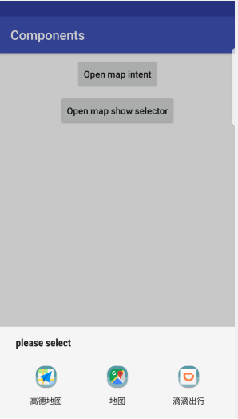

- [Android training 与其他应用交互](http://hukai.me/android-training-course-in-chinese/basics/intents/index.html)

## IntentFilter 匹配规则

Activity 的启动方式分为两种，显式调用和隐式调用。显式调用比较简单，它明确指定了要启动的对象的组件信息。而隐式调用则是通过规则匹配来调用的。隐式调用需要 Intent 能够匹配目标组件的 IntentFilter。 IntentFilter 中的过滤信息有 action、categrory、data，如下面是一个过滤规则

```
<activity android:name=".XXXActivity">
    <intent-filter>
        <action android:name="xxxxx.action"/>
        <action android:name="xxxxx.action2"/>
        <category android:name="xxxxx.c"/>
        <category android:name="xxxx.d"/>
        <category android:name="android.intent.category.DEFAULT"/>
        <data android:mimeType="text/plain"/>
    </intent-filter>
</activity>
```

#### 一些隐式调用的例子

- 如何使用Uri数据发起电话的意图拨打电话

```
Uri number = Uri.parse("tel:5551234");
Intent callIntent = new Intent(Intent.ACTION_DIAL, number);
```
- 查看地图
```
// 基于地址的URI数据
Uri location = Uri.parse("geo:0,0?q=1600+Amphitheatre+Parkway,+Mountain+View,+California");
// 基于经纬度的URI数据
// Uri location = Uri.parse("geo:37.422219,-122.08364?z=14"); // z param is zoom level
Intent mapIntent = new Intent(Intent.ACTION_VIEW, location);
```
- 查看网页
```
Uri webpage = Uri.parse("http://www.android.com");
Intent webIntent = new Intent(Intent.ACTION_VIEW, webpage);
```
- 发送邮件和附件
```
Intent emailIntent = new Intent(Intent.ACTION_SEND);
// 这个Intent没有一个Uri数据, 所以我们应该给其指定一个数据类型
emailIntent.setType(HTTP.PLAIN_TEXT_TYPE);
/*隐含意图需要提供不同数据类型的“额外”数据，例如字符串。 您可以使用各种putExtra（）方法添加一个或多个额外的数据*/
emailIntent.putExtra(Intent.EXTRA_EMAIL, new String[] {"jon@example.com"}); // recipients
emailIntent.putExtra(Intent.EXTRA_SUBJECT, "Email subject");
emailIntent.putExtra(Intent.EXTRA_TEXT, "Email message text");
emailIntent.putExtra(Intent.EXTRA_STREAM, Uri.parse("content://path/to/email/attachment"));
// You can also attach multiple items by passing an ArrayList of Uris
```

- 设置一个日历日程

```
Intent calendarIntent = new Intent(Intent.ACTION_INSERT,Events.CONTENT_URI);

Calendar beginTime = Calendar.getInstance().set(2012, 0, 19, 7,30);
Calendar endTime = Calendar.getInstance().set(2012, 0, 19, 10, 30);
calendarIntent.putExtra(CalendarContract.EXTRA_EVENT_BEGIN_TIME, beginTime.getTimeInMillis());
calendarIntent.putExtra(CalendarContract.EXTRA_EVENT_END_TIME, endTime.getTimeInMillis());
calendarIntent.putExtra(Events.TITLE, "Ninja class");
calendarIntent.putExtra(Events.EVENT_LOCATION, "Secret dojo");
```

####  验证是否有一个应用程序来接收意图

如果你调用意图，但是设备上没有可以处理该意图的应用程序，你的应用程序将崩溃。通过 `queryIntentActivities` 方法我们可以判断是否有应用可以响应我们的意图。

```
PackageManager packageManager = getPackageManager();
List activities = packageManager.queryIntentActivities(intent,
PackageManager.MATCH_DEFAULT_ONLY);
boolean isIntentSafe = activities.size() > 0;
```

判断是否有 Activity 可以匹配我们的隐式 Intent，还有一个方法 Intent 的 `resolveActivity` 方法，如果找不到则返回 null，这个方法是返回最佳匹配的 Activity 信息，而上面的方法是返回所有匹配成功的 Activity 信息。他们的原型如下：

```
public abstract List<ResolveInfo> queryIntentActivities(Intent intent, int flags);
public abstract ResolveInfo resolveActivity(Intent intent, int flags);
```

这里的第二个参数是什么意思呢，比如我们使用 `MATCH_DEFAULT_ONLY` 这个标记位，代表仅仅匹配那些在 intent-filter 中声明了 `<category android:name="android.intent.category.DEFAULT"/>` 这个 category 的 Activity，使用这个标记位的意义在于只要上面两个方法不返回 null，那么一定可以启动成功。如果不使用这个标记位，就可以把 intent-filter 中 category 不含 DEFAULT 的哪些 Activity 给匹配出来，从而导致启动可能失败。（因为 Intent 默认会带上 Default，启动的时候会失败）

#### 使用 intent 启动 Activity

调用 `startActivity()` 启动 intent 后，如果系统识别出多个可以处理意图的程序，则它会显示一个对话框，供用户选择。（注意：如果没有可以处理这个意图的程序，则直接启动会报错，所以我们需要判断一下）

```
// open a map app.
private void openMap() {
    Uri location = Uri.parse("geo:0,0?q=1600+Amphitheatre+Parkway,+Mountain+View,+California");
    Intent mapIntent = new Intent(Intent.ACTION_VIEW, location);
    if (verifyResolves(mapIntent)) {
        startActivity(mapIntent);
    }
}

// verify resolves
private boolean verifyResolves(Intent intent) {
    PackageManager packageManager = getPackageManager();
    List<ResolveInfo> activites = packageManager.queryIntentActivities(intent, 0);
    boolean isIntentSafe = activites.size() > 0;
    return isIntentSafe;
}
```

#### 显示应用选择器

当有多个程序可以响应启动的意图时，用户可以选择默认的程序。但是考虑这种需求，如分享操作，用户每次可能需要选择不同的应用程序，所以选择默认就不行了，满足不了用户的需求，这个时候用户**需要每次启动都弹出选择程序的对话框**。

```
// show app selector.
private void openMapshowSelector() {
    Uri location = Uri.parse("geo:0,0?q=1600+Amphitheatre+Parkway,+Mountain+View,+California");
    Intent mapIntent = new Intent(Intent.ACTION_VIEW, location);
    String title = "please select";
    //显示应用选择界面
    Intent chooser = Intent.createChooser(mapIntent, title);
    if (verifyResolves(mapIntent)) {
        startActivity(chooser);
    }
}
```



#### 从 Activity 获取返回结果

通过调用 `startActivityForResult()` 和 `onActivityResult()` 返回结果，例如：选择联系人

```
static final int PICK_CONTACT_REQUEST = 1; // 请求码，用来标识你的请求
// 选择联系人
private void pickContract() {
    Intent pickContactIntent = new Intent(Intent.ACTION_PICK, Uri.parse("content://contacts"));
    pickContactIntent.setType(ContactsContract.CommonDataKinds.Phone.CONTENT_TYPE); // Show user only contacts w/phone numbers
    startActivityForResult(pickContactIntent, PICK_CONTACT_REQUEST);
}

// 获取选择结果
@Override
protected void onActivityResult(int requestCode, int resultCode, Intent data) {
    // 验证请求码
    if (requestCode == PICK_CONTACT_REQUEST) {
        // resultCode是由被请求 Activity 通过其 setResult() 方法返回。用于标识处理结果，一般成功返回 RESULT_OK
        if (resultCode == RESULT_OK) {
            // 获取选择的联系人的 URI
            Uri contactUri = data.getData();
            // 只需要号码列
            String[] projection = {ContactsContract.CommonDataKinds.Phone.NUMBER};
            // 通过 uri 查询数据
            Cursor cursor = getContentResolver()
                    .query(contactUri, projection, null, null, null);
            cursor.moveToFirst();
            // 获取 NUMBER 在一行数据中的下标位置
            int column = cursor.getColumnIndex(ContactsContract.CommonDataKinds.Phone.NUMBER);
            String number = cursor.getString(column);
            Toast.makeText(mContext, "The numer you picked is " + number, Toast.LENGTH_SHORT).show();
        }
    }
}
```

#### intentFilter 允许其他 APP 启动你的应用程序

**Intent 具有以下四个重要属性**

- **Action**：Action属性的值为一个字符串，它代表了系统中已经定义了一系列常用的动作。通过 `setAction()` 方法或在清单文件 `AndroidManifest.xml` 中设置。默认为：DEFAULT。

- **Data**：Data通常是URI格式定义的操作数据。例如：tel:// 。通过 `setData()`方法设置。

- **Category**：Category 属性用于指定当前动作（Action）被执行的环境。通过 `addCategory()`方法或在清单文件 `AndroidManifest.xml` 中设置。默认为：`CATEGORY_DEFAULT`。

- **Extras**：Extras 属性主要用于传递目标组件所需要的额外的数据。通过 `putExtras()`方法设置。


**四个属性各自的常用值如下所示**

|Action|
|-|
|**ACTION_MAIN**：Android Application的入口，每个Android应用必须且只能包含一个此类型的Action声明。
|**ACTION_VIEW**：系统根据不同的Data类型，通过已注册的对应Application显示数据。
|**ACTION_EDIT**：系统根据不同的Data类型，通过已注册的对应Application编辑示数据。　
|**ACTION_DIAL**：打开系统默认的拨号程序，如果Data中设置了电话号码，则自动在拨号程序中输入此号码。　
|**ACTION_CALL**：直接呼叫Data中所带的号码。　
|**ACTION_ANSWER**：接听来电。　
|**ACTION_SEND**：由用户指定发送方式进行数据发送操作。
|**ACTION_SENDTO**：系统根据不同的Data类型，通过已注册的对应Application进行数据发送操作。
|**ACTION_BOOT_COMPLETED**：Android系统在启动完毕后发出带有此Action的广播（Broadcast）。　
|**ACTION_TIME_CHANGED**：Android系统的时间发生改变后发出带有此Action的广播（Broadcast）。　
|**ACTION_PACKAGE_ADDED**：Android系统安装了新的Application之后发出带有此Action的广播（Broadcast）。　
|**ACTION_PACKAGE_CHANGED**：Android系统中已存在的Application发生改变之后（如应用更新操作）发出带有此Action的广播（Broadcast）。　
|**ACTION_PACKAGE_REMOVED**：卸载了Android系统已存在的Application之后发出带有此Action的广播（Broadcast）。

|**Category**|
|-|
|**CATEGORY_DEFAULT**：Android系统中默认的执行方式，按照普通Activity的执行方式执行。　
|**CATEGORY_HOME**：设置该组件为Home Activity，device 第一次启动时显示的界面或者用户按下Home键显示的界面。
|**CATEGORY_PREFERENCE**：设置该组件为选项面板
|**CATEGORY_LAUNCHER**：设置该组件为在当前应用程序启动器中优先级最高的Activity，通常为入口ACTION_MAIN配合使用。和 ACTION_MAIN 配合使用显示在应用程序列表里。
|**CATEGORY_BROWSABLE**：设置该组件可以使用浏览器启动。

[Android 浏览器调用 APP](https://blog.csdn.net/xiaoqilenovo/article/details/72723288)


|Extras|
|-|
|**EXTRA_BCC**：存放邮件密送人地址的字符串数组。　
|**EXTRA_CC**：存放邮件抄送人地址的字符串数组。
|**EXTRA_EMAIL**：存放邮件地址的字符串数组。　
|**EXTRA_SUBJECT**：存放邮件主题字符串。　
|**EXTRA_TEXT**：存放邮件内容。　
|**EXTRA_KEY_EVENT**：以KeyEvent对象方式存放触发Intent的按键。　　
|**EXTRA_PHONE_NUMBER**：存放调用ACTION_CALL时的电话号码。

|Data|
|-|
|**tel**://：号码数据格式，后跟电话号码。　
|**mailto**://：邮件数据格式，后跟邮件收件人地址。
|**smsto**://：短息数据格式，后跟短信接收号码。
|**content**://：内容数据格式，后跟需要读取的内容。　
|**file**://：文件数据格式，后跟文件路径。
|**market**://search?q=pname:pkgname：市场数据格式，在Google Market里搜索包名为pkgname的应用。
|**geo**://latitude,longitude:经纬数据格式，在地图上显示经纬度指定的位置。


在 intent-filter 中指定 data 属性的实际目的是：要求接收的 Intent 中的 data 必须符合 intent-filter 中指定的 data 属性，这样达到反向限定 Intent 的作用。

例如：在AndroidManifest.xml中进行如下设置：
```
<activity android:name=".TestActivity">
    <intent-filter>
        <action android:name="com.ramon.test"/>
        <data android:scheme="file"/>
    </intent-filter>
</activity>
```

那么启动该Activity的Intent必须进行如下设置：
```
Intent intent = new Intent();
Uri uri = Uri.parse("file://com.android.test:520/mnt/sdcard");
intent.setData(uri);
```

#### 总结：intent filter 匹配规则

- **Action**：action 要求 Intent 中的 action 存在且必须和过滤规则中的其中一个 action 相同，也就是只要存在一个 action 和过滤规则中相同就可以匹配。

- **Category**：这里有两种情况。
    - 第一种：intent 中含有 category，那么所有的 category 必须和过滤规则中的其中一个 category 相同，也就是说 intent 中携带的 category 过滤规则中必须有。
    - 第二种：intent 中没有 category，如果没有 category 的话，这个 intent 仍然可以匹配成功。为什么不设置 category 也可以匹配成功呢？原因是系统在调用的时候会默认为 Intent 加上了 `android.intent.category.DEFAULT` 这个 category，为了使我们的 activity 能够接受隐式调用，就必须在 intent-filter 中指定 `android.intent.category.DEFAULT` 这个 category。

- **data属性解析**
    - `<scheme>://<host>:<port>/[<path>|<pathPrefix>|<pathPattern>]/mimeType`
        - URI 为 [mimeType](./MIME-introduce.md) 前面的部分，mimeType设置了数据的类型
        - Scheme： URI 的模式，比如 http、file、content等，如果 URI 中没有指定 schema，那么整个 URI 的其他参数无效，这也意味着 URI 是无效的
        - Host:URI 的主机名，如 www.baidu.com, 如果 host 未指定，那么整个URL 中的其他参数无效，也意味着 URI 是无效的。
        - Post：URI 中的端口号，比如 80，仅当 URI 中指定了 scheme 和 host 参数的时候 port 参数才有意义。
        - Path、pathPattern 和 pathPrefix：这三个参数表示路径信息，其中 path 表示完整的路径信息；pathPattern 也表示完整的路径信息，但是它里面可以包含通配符 `「*」`，注意如果要表示真实的字符串，这时候需要转义`「*」`表示为`「\\*」`,`「\」`要写成`「\\\\」`；pathPrefix 表示路径的前缀信息。
        - 举例说明
        - content://com.example.project:200/folder/subfloder/etc
            - scheme-->content
            - host-->com.example.project
            - port-->200
            - path-->folder/subfolder/etc

- **data 匹配规则**: 它要求 Intent 中必须含有 data 数据，并且 data 数据能够完全匹配过滤规则中的某一个 data，完全匹配是指过滤规则中出现的 data 部分也出现在了 Intent 中的 data 中。

下面分情况说明：

（1）如下过滤规则
```
<intent-filter>
    <data android:mimeType="image/*"/>
</intent-filter>
```
这种规则指定了媒体类型为所有类型的图片，那么 Intent 中的 mimeType 为 “image/*” 才能匹配。「这种情况下没有指定 URI，但是却是有默认值的」，URI 的默认值为 content 和 file，也就是所，虽然没有指定 URI，但是 Intent 的 URI 部分的 schema 必须为 content 或者 file 才能匹配，特别注意。为了匹配上面的规则，我们可这样写：

```
intent.setDataAndType(Uri.parse("file://abc"),"image/png");
```

需要注意，如果要为 Intent 设置完整的 data，必须调用 setDataAndType 方法，不能先调用 setData 再调用 setType，因为两个方法彼此会清除对方的值。比如 setData:
```
public Intent setData(Uri data) {
    mData = data;
    mType = null;
    return this;
}
```
setData 把 mimeType 设置为了 null， 同理 setType 也会把 URI 设置为 null。

（2）如下过滤规则
```
<intent-filter>
    <data android:mimeType="video/mpeg" android:scheme="http" .../>
    <data android:mimeType="audio/mpeg" android:scheme="http" .../>
</intent-filter>
```

为了匹配上面的规则我们可以这样写
```
intent.setDataAndType(Uri.parse("http://abc"), "video/mpeg");
```
或者
```
intent.setDataAndType(Uri.parse("http://abc"),"audio/mpeg")
```

data 有一点和 action 不同，就是它有两种特殊写法
```
<intent-filter>
    <data android:scheme="file" android:host="www.baidu.com"/>
</intent-filter>

<intent-filter>
    <data android:scheme="file"/>
    <data android:host="www.baidu.com">
</intent-filter>
```