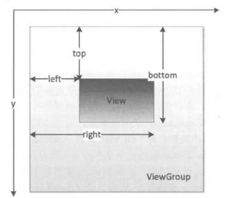
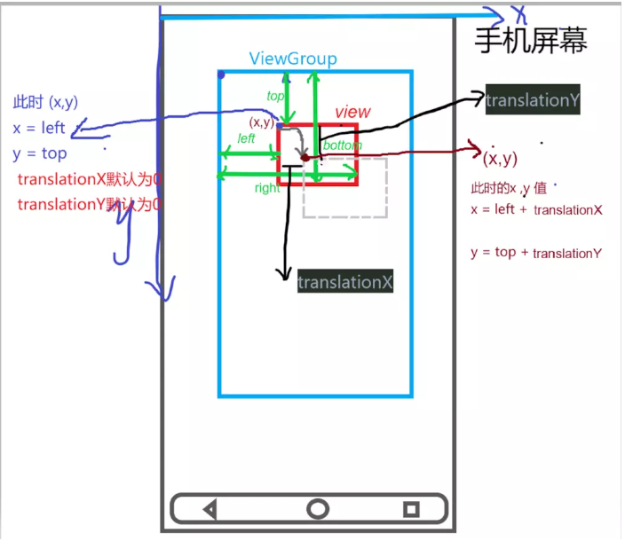

- [【源码解析】View的事件分发](https://www.jianshu.com/p/5ec375057127)
- 《Android 开发艺术探索》 第三章
- https://github.com/LRH1993/android_interview/blob/master/android/basis/Event-Dispatch.md

## View 基础知识

`View` 是 `Android` 中所有控件的基类，如 `Button` 或 `ListView`。`ViewGroup` 也继承了 `View`，也就是说 `View` 可以是单个控件也可以是由多个控件组成的一组控件。

#### View 的位置参数

`View` 的位置主要由它的四个顶点来决定，分别对应 `View` 的四个属性： `top、left、right、bottom`（如下图）。需要注意的是，这些坐标都是相对于 `View` 的父容器来说的，因此它是一种相对坐标。



根据上图，可以很容易得出 View 的宽高

```
width = right - left;
height = bottom - top;
```

`View` 源码中获取这四个参数的方法是

```
left = getLeft();
right = getRight();
top = getTop();
bottom = getBottom();
```

`Android 3.0` 以后， `View` 增加了几个参数 「`x 、y、translationX、translationY`」，其中 `x` 和 `y` 是 `View` 左上角的坐标，而 `translationX` 和 `translationY` 是 `View` 左上角相对于父容器的偏移量，它们的默认值是 0。几个参数的换算关系是



```
x = left + translationX;
y = top + translationY;
```

> 注意： `View` 在平移的过程中， `top` 和 `left` 表示的是原始左上角的位置信息，其值并不会发生改变，此时发生改变的是 `x、y、translationX` 和 `translationY` 这四个参数。

#### MotionEvent 和 TouchSlop

**MotionEvent**：在手指接触屏幕后所产生的一系列事件，典型的有如下几种：

- `ACTION_DOWN`：手指刚接触屏幕
- `ACTION_MOVE`:手指在屏幕上移动
- `ACTION_UP`:手指在屏幕上松开的一瞬间

通过 `MotionEvent` 对象我们可以得到点击事件发生的 `x` 和 `y` 坐标，系统提供了两种方法：

- `getX/getY` ：返回的是相对于当前 `View` 左上角的 `x` 和 `y` 坐标。(表示 View 内部的坐标)
- `getRawX/getRawY`: 返回相对于手机屏幕左上角的 `x` 和 `y` 坐标。(表示相对于屏幕的位置)

**TouchSlop**：系统所能识别出的被认为最小滑动距离值，这是一个常量，和设备有关，通过方法 `ViewConfiguration.get(getContext()).getScaledTouchSlop()` 获得。应用场景：当我们在处理滑动时，可以利用这个常量来做一些过滤，比如两次滑动事件的滑动距离小于这个值，则认为它们不是滑动。

在源码中的位置为：`frameworks/base/core/res/res/values/config.xml`
```
<dimen name="config_viewConfigurationTouchSlop">8dp</dimen>
```

#### VelocityTracker、GestureDetector 和 Scroller

**VelocityTracker**: 用于追踪手指在滑动过程中的速度，包括水平和竖直方向的速度。

1. 首先，在 `View` 的 `onTouchEvent` 方法中追踪当前单击事件的速度

```
VelocityTracker velocityTracker = VelocityTracker.obtain();
velocityTracker.addMovement(event);
```

2. 接着当我们需要知道当前的滑动速度的时候，使用如下方法

```
// 获取速度前需要先计算速度，参数表示时间
velocityTracker.computeCurrentVelocity(1000);
// 速度表示 1000 毫秒内滑过的像素，可以是正值也可以是负值
int xVelocity = (int) velocityTracker.getXVelocity();
int yVelocity = (int) velocityTracker.getYVelocity();
```

3. 当最后不需要时候，需要调用 `clear` 方法来重置并回收内存。

```
velocityTracker.clear();
velocityTracker.recycle();
```

**GestureDetector** : 手势检测，用于辅助检测用户的单击、滑动、长按、双击行为。

1. 首先需要创建一个 `GestureDetector` 对象并实现 `OnGestureListener` 接口，根据需要我们还可以实现 `OnDoubleTagListener` 来监听双击行为

```
GestureDetector mGestureDetector = new GestureDetector(this);
// 解决长按屏幕后无法拖动的问题
mGestureDetector.setIsLongpressEnable(false);
```

2. 接着在待监听 `View` 的 `onTouchEvent` 方法中添加如下实现：

```
boolean consume = mGestureDetector.onTouchEvent(event);
return consume;
```

3. 接下来我们就可以有选择的实现 `OnGestureListener` 和 `OnDoubleTapListener` 中的方法。


方法名| 描述 | 所属接口
---| --- |---
onDown | 手指轻轻触摸屏幕的瞬间，由 1 个 `ACTION_DOWN` 触发 | OnGestureListener
onShowPress | 手指轻轻触摸屏幕，尚未松开或者拖动，由 1 个 `ACTION_DOWN` 触发，它强调的是没有松开或者拖动的状态 | OnGestureListener
onSingleTagUp | 手指轻轻触摸屏幕后松开，伴随着 1 个 MotionEvent ACTION_UP 触发，是单击行为 | OnGestureListener
onScroll | 手指按下屏幕并拖动，由 1 个 ACTION_DOWN, 多个 ACTION_MOVE 触发 | OnGestureListener
onLongPress | 用户长久的按着屏幕不放，即长按 | OnGestureListener
onFling | 用户按下触摸屏，快速滑动后松开，由 1 个 ACTION_DOWN 多个 ACTION_MOVE 和一个 ACTION_UP 触发，这是快速滑动行为 | OnGestureListener
OnDoubleTap | 双击，由 2 次连续的单击组成，它不可能和 onSingleTapConfirmed 共存 | OnDoubleTapListener
onSingleTagConfirmed | 严格的单击行为，如果触发了 onSingleTapConfirmed, 那么后面不可能再紧跟着另一个单击行为，即这只可能是单击，而不可能是双击中的一次单击| OnDoubleTapListener
onDoubleTapEvent | 表示发生了双击行为，在双击期间，ACTION_DOWN/ACTION_MOVE/Action_up 都会触发此回调 | OnDoubleTapListener

> 建议：如果只是监听滑动相关的，建议在 onTouchEvent 中实现，如果需要监听双击这种行为的话，使用 GestureDetector


**Scroller**：弹性滑动对象，用于实现 View 的弹性滑动，当使用 View 的 `scrollTo` / `scrollBy` 方法来滑动的时候，其过程是瞬间完成的，没有过渡效果，用户体验不好。

`Scroller` 本身无法让 `View` 弹性滑动，它需要和 `View` 的 `computeScroll` 方法配合使用才能共同完成这个功能，它的典型代码如下

```
Scroller scroller = new Scroller(mContext);

// 缓慢滑动到指定位置
private void smoothScrollTo(int destX, int destY) {
    int scrollX = getScrollX();
    int delta = destX - scrollX;
    // 1000 ms 内滑向 destX
    mScroller.startScroll(scrollX, 0, delta, 0, 1000);
    invalidate();
}

@Override
public void computeScroll() {
    if (mScroller.computeScrollOffset() ) {
        scrollTo(mScroller.getCurrX(), mScroller.getCurrY());
        postInvalidate();
    }
}
```

> 后面会介绍 Scroller 的具体用法
