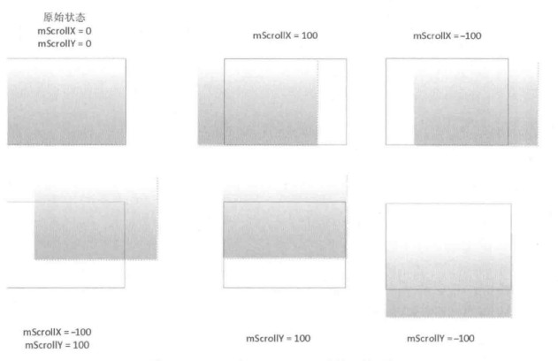

## View 的滑动

常见的滑动方法有三种：

- 通过 `View` 本身提供的 `scrollTo/scrollBy` 方法来实现滑动。
- 通过动画给 `View` 施加平移效果来实现滑动。
- 通过改变 `View` 的 `LayoutParams` 使得 `View` 重新布局实现滑动


#### 使用 scrollTo/scrollBy

我们来看一下这两个方法的实现

```
/**
 * Set the scrolled position of your view. This will cause a call to
 * {@link #onScrollChanged(int, int, int, int)} and the view will be
 * invalidated.
 * @param x the x position to scroll to
 * @param y the y position to scroll to
 */
public void scrollTo(int x, int y) {
    if (mScrollX != x || mScrollY != y) {
        int oldX = mScrollX;
        int oldY = mScrollY;
        mScrollX = x;
        mScrollY = y;
        invalidateParentCaches();
        onScrollChanged(mScrollX, mScrollY, oldX, oldY);
        if (!awakenScrollBars()) {
            postInvalidateOnAnimation();
        }
    }
}

/**
 * Move the scrolled position of your view. This will cause a call to
 * {@link #onScrollChanged(int, int, int, int)} and the view will be
 * invalidated.
 * @param x the amount of pixels to scroll by horizontally
 * @param y the amount of pixels to scroll by vertically
 */
public void scrollBy(int x, int y) {
    scrollTo(mScrollX + x, mScrollY + y);
}
```

从上面可看出，`ScrollBy` 实际也是调用了 `scrollTo`，它实现了基于当前位置的相对滑动。

滑动的过程是改变了 `View` 内部的属性 `mScrollX` 和 `mScollY`，这两个属性可以通过 `getScrollX` 和 `getScrollY` 方法得到。

在滑动过程中，`mScrollX` 的值总是等于 `View` 左边缘和 `View` 内容左边缘在水平方向的距离，而 `mScrollY` 的值总是等于 `View` 上边缘和 `View` 内容上边缘在竖直方向的距离。如下图：




#### 使用动画

使用动画来移动 `View`，主要是操作 `View` 的 `translationX` 和 `translationY` 属性。

例： 采用属性动画移动 `View`

```
ObjectAnimator.ofFloat(scrollList, "translationY", 0, 100)
    .setDuration(2000).start();
```

> 注意：View 动画是对 View 的影像进行操作，它并不能真正改变 View 的参数位置，如果希望动画后的状态得以保留还必须将 fillAfter 属性设置为true，否则动画完成后其结果会消失。使用属性动画不会存在这个问题。


#### 改变布局参数

改变 `LayoutParams` 参数，如果想把一个 `View` 向下移动 `200 px`，只需要设置 `marginTop` 增加 `200` 就可以了。

```
ViewGroup.MarginLayoutParams params = (ViewGroup.MarginLayoutParams)        scrollList.getLayoutParams();
params.topMargin += 200;
scrollList.requestLayout();
```

#### 三种滑动方式的对比

- `scrollTo/scrollBy`: 它是 `View` 提供的原生方法，其作用是专门用于 View 的滑动，滑动不会影响内部元素的单击事件。它的缺点是：**它只能滑动 View 的内容，并不能滑动 View 本身。**


- **动画**：通过动画实现 View 的滑动，需要分情况，Android 3.0 以上并采用属性动画，没有明显的缺点。如果使用 View 动画或者在 Android 3.0 以下使用属性动画，均不能改变 View 本身的属性。实际开发中，如果动画元素不需要响应用户的交互，则可以使用动画，否则就不太合适。动画有一个明显优点，一些复杂的效果必须通过动画才能实现。


- **改变布局参数**：操作稍微复杂点，适用于有交互的 View。


## 弹性滑动

弹性滑动的思想：**将一次大的滑动分成若干次的小的滑动并在一个时间段内完成**。

#### Scroller

`Scroller` 的使用代码如下，上面我们已经提到过：

```
Scroller mScroller = new Scroller(mContext);

// 缓慢滑动到指定位置
private void smoothScrollTo(int destX, int destY) {
    int scrollX = getScrollX();
    int delta = destX - scrollX;
    // 1000 ms 内滑向 destX
    mScroller.startScroll(scrollX, 0, delta, 0, 1000);
    invalidate();
}

@Override
public void computeScroll() {
    if (mScroller.computeScrollOffset() ) {
        scrollTo(mScroller.getCurrX(), mScroller.getCurrY());
        postInvalidate();
    }
}
```

下面来分析它为什么能实现弹性滑动

- 1.首先构造了一个 `Scroller` 对象并且调用它的 `startScroll` 方法时，`Scroller` 内部其实什么也没做，它只是保存了我们传递的几个参数，该方法源码如下：

```
public void startScroll(int startX, int startY, int dx, int dy, int duration) {
    mMode = SCROLL_MODE;
    mFinished = false;
    mDuration = duration;
    mStartTime = AnimationUtils.currentAnimationTimeMillis();
    mStartX = startX;
    mStartY = startY;
    mFinalX = startX + dx;
    mFinalY = startY + dy;
    mDeltaX = dx;
    mDeltaY = dy;
    mDurationReciprocal = 1.0f / (float) mDuration;
}
```

`startX、startY` 表示滑动的起点，`dx` 和 `dy` 表示的是要滑动的距离，`duration` 表示滑动的时间。

通过代码可以看到，调用 `startScroll` 方法是无法让 `View` 滑动的，那么它是如何滑动的，答案就是 `startScroll` 方法下面的 `invalidate` 方法，这个方法会导致 View 的重绘，在 View 的 draw 方法中又会去调用 `computeScroll` 方法，正是因为这个 `ComputeScroll` 方法 `View` 才能实现弹性滑动。

`computeScroll` 会去向 `Scroller` 获取当前的 `scrollX` 和 `scrollY`，然后通过 `scrollTo` 方法实现滑动，接着又调用 `postInvalidate` 方法进行第二次重绘，这次和第一次一样，还是会导致 `computeScroll` 方法被调用，然后继续向 `Scroller` 获取当前的 `scrollX` 和 `scrollY`，并通过 `scrollTo` 方法滑动到新的位置，如此反复，直到滑动结束。

来看一下 `Scroller` 的 `computeScrollOffset` 方法

```
public boolean computeScrollOffset() {
    if (mFinished) {
        return false;
    }
    // 计算经过了多长时间
    int timePassed = (int)(AnimationUtils.currentAnimationTimeMillis() - mStartTime);
    // 时间小于滚动时长
    if (timePassed < mDuration) {
        switch (mMode) {
        case SCROLL_MODE:
            final float x = mInterpolator.getInterpolation(timePassed * mDurationReciprocal);
            mCurrX = mStartX + Math.round(x * mDeltaX);
            mCurrY = mStartY + Math.round(x * mDeltaY);
            break;
        ...
        }
    }
    else {
        mCurrX = mFinalX;
        mCurrY = mFinalY;
        mFinished = true;
    }
    return true;
}
```

这个方法会根据时间的流逝来计算出当前的 `scrollX` 和 `scrollY` 的值，这个方法返回 true 表示滑动还未结束，返回 false 表示滑动结束。

> 通过上面的分析我们可以知道： `Scroller `本身并不能实现 `View` 的滑动，它需要配合 `View` 的 `computeScroll` 方法才能完成弹性滑动的效果，它不断让 `View` 重绘，而每次重绘距离滑动起始时间有个时间间隔，通过这个时间间隔 `Scroller` 就可以计算出 `View` 当前滑动的位置，然后通过 `scrollTo` 完成滑动。


#### 通过动画实现弹性滑动

在下面的代码中，我们的动画本质上没有作用于任何对象，它只是在 2000ms 内执行完了，我们利用动画执行过程的回调通过调用 `scrollTo` 实现弹性滑动。利用这种思想除了实现弹性滑动，还能实现其他的一些操作。

```
 // 利用动画的特性来实现弹性滑动
final int startY = 0;
final int deltaY = 300;
final ValueAnimator animator = ValueAnimator.ofInt(0, 1).setDuration(2000);
animator.addUpdateListener(new ValueAnimator.AnimatorUpdateListener() {
    @Override
    public void onAnimationUpdate(ValueAnimator valueAnimator) {
        float fraction = animator.getAnimatedFraction();
        scrollList.scrollTo(0, startY + (int)(deltaY * fraction));
    }
});
animator.start();
```


#### 使用延时策略

**延时策略**：通过发送一系列的延时消息从而实现一种渐进的效果，具体可以使用 `Handler` 或者 `View` 的 `postDelayed` 方法，也可以使用线程的 `sleep` 方法，下面采用 `Handler` 作为示例：每隔 33 毫秒给自己发送消息进行滑动。

```
private static final int MESSAGE_SCROLLTO = 1;
private static final int FRAME_COUNT = 60; // 60 帧
private static final int DELAYED_TIME = 33; // 两帧间隔 33 毫秒

private int mCount = 0;

private Handler mHandler = new Handler(){
    @Override
    public void handleMessage(Message msg) {
        switch (msg.what) {
            case MESSAGE_SCROLLTO: {
                mCount ++;
                if (mCount <= FRAME_COUNT) {
                    float fraction = mCount / (float) FRAME_COUNT;
                    int scrollY = (int)(fraction * 1000);
                    scrollList.scrollTo(0, scrollY);
                    mHandler.sendEmptyMessageDelayed(MESSAGE_SCROLLTO, DELAYED_TIME);
                }
                break;
            }
            default:
                break;
        }
    }
};
```